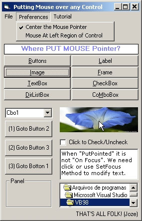



## Put Mouse Pointer  any Control w/o hWnd

### Description

Very simple few lines code to put the mouse pointer over any control without use hWnd. Two subroutines, one for Centered other for near Left positioning. Supports all Screen resolutions and Controls resizeing.
 
### More Info
 

             |
---                |---
**Submitted On**   |2005-09-09 19:05:54
**By**             |[JOZE Walter Moura](https://github.com/Planet-Source-Code/PSCIndex/blob/master/ByAuthor/joze-walter-moura.md)
**Level**          |Intermediate
**User Rating**    |4.8 (19 globes from 4 users)
**Compatibility**  |VB 5\.0, VB 6\.0
**Category**       |[Coding Standards](https://github.com/Planet-Source-Code/PSCIndex/blob/master/ByCategory/coding-standards__1-43.md)
**World**          |[Visual Basic](https://github.com/Planet-Source-Code/PSCIndex/blob/master/ByWorld/visual-basic.md)
**Archive File**   |[Put\_Mouse\_193114992005\.Zip](https://github.com/Planet-Source-Code/joze-walter-moura-put-mouse-pointer-any-control-w-o-hwnd__1-62497/archive/master.zip)

